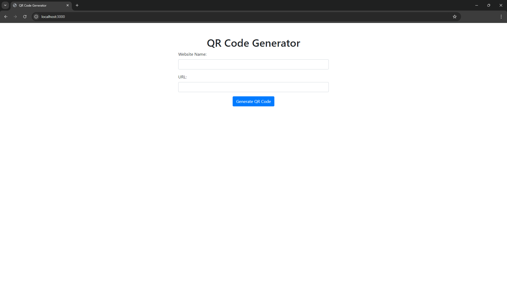
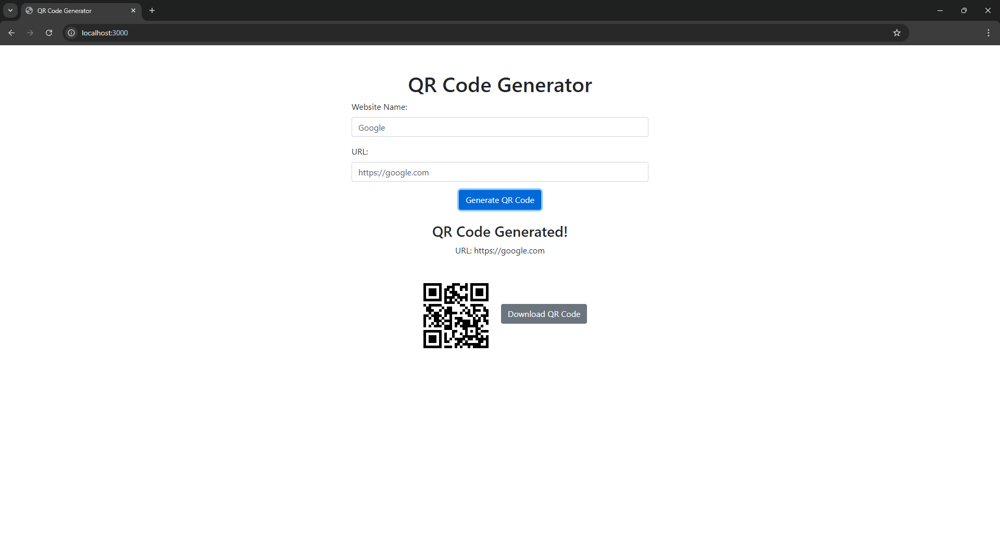

# 📦 QR Code Generator

Welcome to the QR Code Generator project! This simple web application allows you to generate QR codes for any URL, which you can then download and use as needed. The application features a form where users can input a website name and URL to generate a QR code.

## ✨ Features

- **Generate QR Codes:** Create a QR code for any URL.
- **Downloadable Images:** Save the QR code image and URL text.
- **Organized Storage:** QR codes and URLs are saved in specific directories.

## 🚀 Getting Started

To get started with this project, follow these instructions:

### 1. Clone the Repository

```bash
git clone https://github.com/SujitChaudhary2005/QR-Code-Generator.git
cd Qr-Code-Generator
```
### 2. Install Dependencies
Make sure you have Node.js installed. Run the following command to install the required packages:

```bash
npm install
```
### 3. Start the Server
After installing the dependencies, start the server with:

```bash
npm start
```
The server will start on http://localhost:3000. Open this URL in your browser to access the QR Code Generator.

### 📸 Screenshots
- QR Code Generator Interface
<div style="display: flex; flex-direction: row;">
    
    
</div>

### 📂 Project Structure
```plaintext
qr-code-generator/
├── public/
│   ├── image/              # Folder to store generated QR code images
│   ├── url_text/           # Folder to store URL text files
│   ├── index.html          # Main HTML file
│   ├── script.js           # JavaScript functionality for the application
│   └── styles.css          # Custom styles for the application
├── screenshots/            # Screenshots of project
│   ├── Image1.png
│   └── Image2.png          
├── README.md               # Project documentation
├── package-lock.json       # Exact versions of dependencies
├── package.json            # Project metadata and dependencies
└── server.js               # Node.js server with Express
```

### 📜 Instructions
- **HTML Form**: Users enter the website name and URL to generate a QR code.
- **CSS Styling**: Custom styles are applied to ensure a clean and user-friendly interface.
- **JavaScript Functionality**: Handles form submission and displays the generated QR code along with a download link.

### 📦 Dependencies
The project relies on the following npm packages:

- **express**: Web framework for Node.js.
- **qr-image**: Library for generating QR codes.

### 📝 License
This project is licensed under the MIT License.

### 🆘 Troubleshooting
If you encounter any issues, please check the following:

- Ensure all dependencies are installed correctly.
- Verify that the server is running and accessible.

Feel free to open an issue or submit a pull request if you have any improvements or fixes! 💻💪
